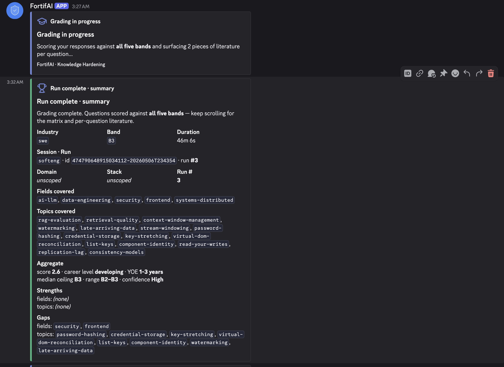
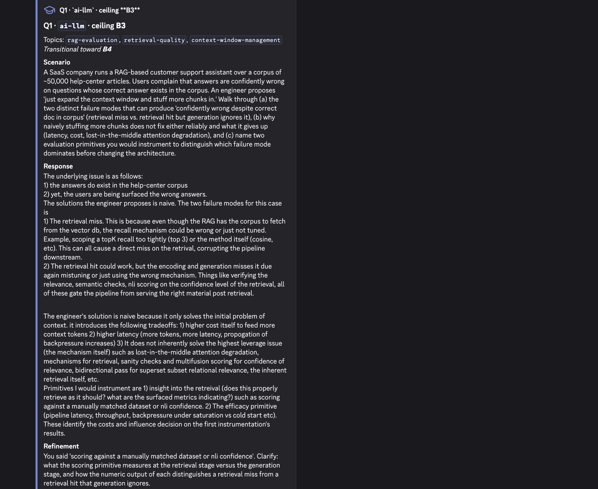
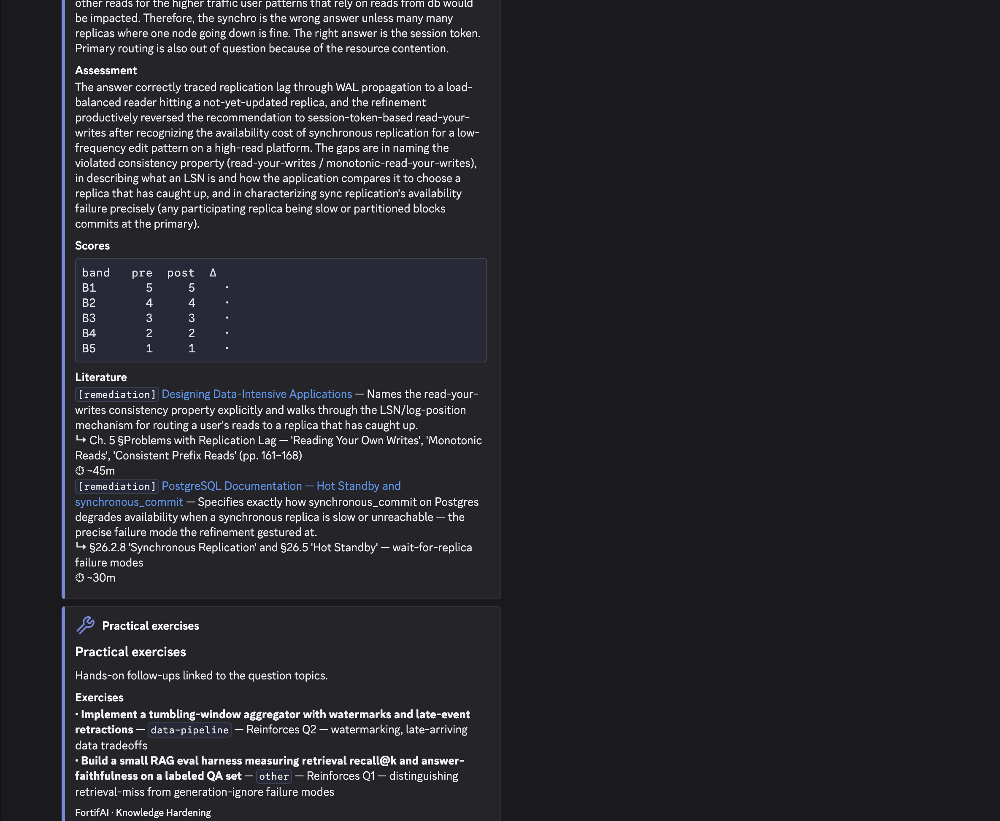
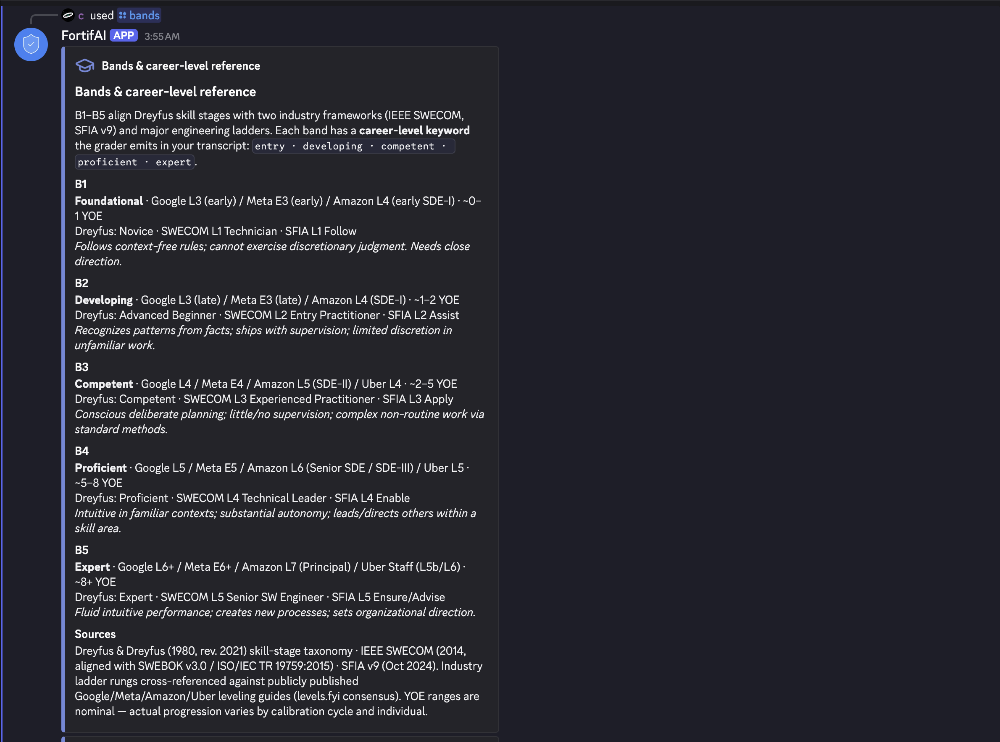
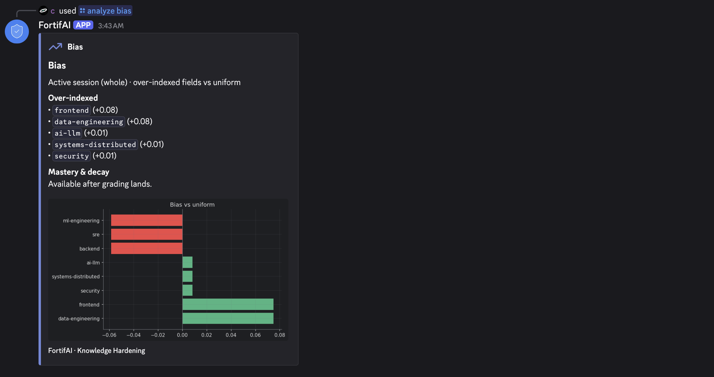

# FortifAI

A protocol for band-calibrated technical knowledge recall hardening. Question generation, refinement, and grading anchored to cited competence frameworks (Dreyfus) and SWE industry standards (IEEE SWECOM, SFIA). What gets tested and how it's scored come from published criteria, not the LLM's judgment.

FortifAI is a Discord bot calibrated to software engineering, however the pipeline (`[phases/](phases/)`) is platform and industry agnostic and contains zero Discord coupling; both surfaces can be swapped without touching the LLM contract.

## Thesis

### **The assymetry between cognitive outsourcing and foundational understanding can be solved with the same innovation driving the gap.**

As LLMs become indispensable in technical workflows, distinguishing genuine competency from LLM-augmented fluency gets harder for hiring managers, mentors, and practitioners self-assessing alike. FortifAI inverts the pressure: rather than using an LLM to get to or produce the answer, it uses one as a constrained tutor that generates band-calibrated questions, probes the highest-leverage gap in the reply, and scopes literature to where the answerer actually is. Ethical AI usage should be bidirectional: Leverage the demonstrated output velocity and efficiency AI assistance has demonstrated, and also ensure the knowledge substrate underlying responsible use is preserved through its inherent capability as an on-demand calibrated tutor. 

## Applications

- **As a software-engineering study companion.** Install, configure a Discord bot, run `/knowledgeharden`. Shipped `templates/swe/` covers 8 engineering fields graded against Dreyfus (cross-domain) plus SWECOM and SFIA (SWE-specific). Multi-session, multi-user, persistent reading list per session.
- **Agnostic encoding.** Author `templates/<your-domain>/{score,generation,refine,grader}.md` and update `[parse.CANONICAL_FIELDS](parse.py)` to your domain's taxonomy: security, ML research, clinical informatics, regulatory compliance, anything with cited band criteria. The pipeline picks up the new industry on next run.
- **As a phase pipeline you wrap.** `[phases/](phases/)` exposes pure functions implementing the LLM contract with strict JSON validation. Build a CLI, web app, or Slack/Teams equivalent against the [public surface](#public-surface); only `[commands/](commands/)` and `[main.py](main.py)` are Discord-specific.

> **NOT A CREDENTIALING REPLACEMENT.** This tool does not certify competence and does not substitute for accredited programs. It is a *support* layer, meant to help practitioners prepare for, identify gaps relative to, and meet criteria that certain industries and institutions actually adjudicate (SFIA-aligned employers, IEEE certifications, Dreyfus-informed mentorship). Outputs are diagnostic; treat them as a study companion, not a verdict.  
>
> **COMPETENCE DOES NOT EQUATE TO MASTERY.** This tool surfaces conceptual and foundational competence with rigor, but does NOT surface innate mastery of the topics. Mastery can only be met with deeper understanding and years working within the topic, competence is the substrate upon which mastery can be built on.

## Features

- `**/knowledgeharden` quiz loop.** 5 scenario short answer questions (one per field) calibrated to a target band (B1–B5), a refinement probe on the highest-leverage gap, and multi-band grading with 2 literature picks per question. Time constrained.
- **Sessions.** `/sessionbegin`, `/sessionend`, `/sessionswitch`, `/sessionlist`, `/sessionrestore` — multiple concurrent contexts per user, runs persisted across restarts, deduplicated reading list emitted on close. `/sessionbegin` optionally declares default `industry`/`fields`/`topics`/`domain`/`stack`, inherited by `/knowledgeharden` when per-run args are unset.
- **Analytics.** `/stats runcount|timeline|session` and `/analyze trends|gaps|bias` surface coverage, growth deltas, and field-rotation bias as embeds with inline matplotlib charts.
- `**/transcript`.** Dumps the full Q&A, grading, and literature for any past run.
- **Reminders & sweep.** Recurring DM nudges via APScheduler (sqlite-backed); `/sweep` reclaims abandoned runs, regrades failures, and heals the meta.json catalog from run history (modes: `cleanup`, `regrade`, `catalog`, `all`).
- **8 SWE fields out of the box.** `templates/swe/` ships graded against Dreyfus + SWECOM + SFIA; drop a `templates/<industry>/` directory to add a domain.

## Examples

### A `/knowledgeharden` run, end to end

After 5 questions and 5 refinement probes, the grader scores against all five bands and emits a summary, per-question breakdown, and a list of practical follow-ups.

**Run summary** — industry, band, duration, fields/topics covered, aggregate score, career level, YOE estimate, strengths/gaps:



**Per-question breakdown** — scenario, the user's response, and the refinement probe that targets the highest-leverage gap:



**Assessment, scores, literature, exercises** — assessment narrative, per-band score table (`B1..B5` × pre/post/Δ), 2 literature entries per question (mix driven by the post-refinement score), and a separate practical-exercises embed at the end of the run:



### Reference & analytics

`/bands` — explains B1–B5 against Dreyfus, IEEE SWECOM, SFIA v9, and the Google/Meta/Amazon/Uber engineering ladders, with a calibration verdict against your latest run:



`/analyze bias` — flags fields you've over-indexed relative to uniform coverage so the next session can rebalance:



## Governance

Off-the-shelf LLMs will quiz you, but their questions drift in difficulty, bias toward fashionable topics, and grade against whatever rubric they invent in the moment. Three constraints anchor every call:

1. **Empirical anchor.** Every system prompt is stitched in three layers: cross-domain Dreyfus skill stages from `[templates/dreyfus.md](templates/dreyfus.md)`, domain-specific seniority frameworks from `[templates/<industry>/score.md](templates/swe/score.md)` (SWECOM and SFIA for swe), then the procedural template (`generation.md` or `grader.md`). Both generator and grader see the same band ladder, so questions are calibrated against the rubric they'll later be scored on.
2. **Strict output contracts.** Every LLM call is parsed against a JSON schema and validated; failures retry once with the validator's error echoed back. Questions must cover exactly 5 fields; literature must be exactly 2 entries per question; the literature mix is deterministic in the post-refinement score.
3. **Field-rotation weighting.** When fields aren't explicit, the generator weights toward fields with fewer recorded topics in `meta.json`, countering the LLM's bias toward systems-distributed / ml-engineering / ai-llm content.

## Accelerate

Ad-hoc AI-assisted study fragments across disconnected chat sessions: useful in the moment, hard to consolidate. The protocol turns disconnected runs into a longitudinal study loop:

- **Calibrates difficulty to where you are.** A fully-mastered practitioner at the target band scores 5/5; a one-band-below practitioner caps at 3/5. Drift is a hard constraint in both the generator's prompt and the validator ([phases/generation.py](phases/generation.py)).
- **Scopes literature to your proficiency.** The grader's literature mix is deterministic, driven by the post-refinement score *at your primary evaluation band*: 5 → 2 growth (ceiling hit; next band's reading); 4 → 1 growth + 1 remediation; ≤3 → 2 remediation. Enforced in [phases/grading.py](phases/grading.py). You won't get pointed at a Dreyfus-stage-5 paper while still building stage-3 mechanism understanding.
- **Tracks growth over time.** `meta.json` accumulates field/topic coverage across runs. `/analyze trends|gaps|bias` surfaces where you've improved, where you haven't been tested, and where you're over-indexing. `/sessionend` emits a deduplicated reading list across all graded runs in the session.

## Phases

A single quiz run executes four phases. 0/2/4 are LLM-driven; 1/3 collect user answers in the Discord layer.


| Phase                 | Module                                       | Entry point                                                                               | What it does                                                                                                                                                                                                                                                                                                                                        |
| --------------------- | -------------------------------------------- | ----------------------------------------------------------------------------------------- | --------------------------------------------------------------------------------------------------------------------------------------------------------------------------------------------------------------------------------------------------------------------------------------------------------------------------------------------------- |
| **0: Generation**     | [phases/generation.py](phases/generation.py) | `generate(industry, fields, topics, answerer_band, domain, stack, context_notes) -> dict` | One LLM call. Produces 5 scenario questions, one per field, calibrated to a target band (B1-B5). System prompt = `dreyfus.md` + `<industry>/score.md` + `<industry>/generation.md`.                                                                                                                                                                 |
| **1: Answer**         | [main.py](main.py) `_run_quiz`               | (interactive)                                                                             | Discord thread collects each answer with a 10-min countdown — recall on the fly, not a research window.                                                                                                                                                                                                                                              |
| **2: Refinement**     | [phases/refinement.py](phases/refinement.py) | `refine(question_id, question_record, answerer_band, industry) -> dict`                   | One LLM call per question. Probes the highest-leverage gap with a quoted-substring follow-up. Falls back deterministically if validation repeatedly fails.                                                                                                                                                                                          |
| **3: Refined answer** | [main.py](main.py) `_run_quiz`               | (interactive)                                                                             | Discord collects the refinement reply with a 5-min countdown — tighter than Phase 1 because the gap is already named and the answer is recall, not synthesis.                                                                                                                                                                                       |
| **4: Grading**        | [phases/grading.py](phases/grading.py)       | `grade(industry, answerer_band, current_run, entry_state, comparison_points) -> dict`     | One LLM call. Scores each question against **all 5 bands**, computes aggregate + career level + YOE estimate, and produces 2 literature entries per question (mix driven by the primary-band score: 5 → 2 growth; 4 → 1 growth + 1 remediation; ≤3 → 2 remediation). System prompt = `dreyfus.md` + `<industry>/score.md` + `<industry>/grader.md`. |


Each phase has its own validator (`_validate_generation`, `_validate_refinement`, `_validate_grading`) enforcing the JSON schema before the result is accepted.

## Architecture

Three packages plus a few supporting modules. Public import paths stay stable via thin facades.

```
content/             Presentation primitives (design tokens, embed builders, charts)
  shared.py            colors, ICON_NAMES, build(), error/info/confirm_embed, _chunk_field
  charts.py            matplotlib chart builders
  quiz.py              question/refinement/skip/run_complete embeds
  session.py           session_rollup_embed (deduped reading list at /sessionend)
  stats.py             stats_embed_from_view (analytics → embed renderer)
  analyze.py           analyze_embed_from_view (analytics → embed renderer)

phases/              LLM phase logic (Generation / Refinement / Grading)
  shared.py            template loader, JSON extraction, list_industries
  generation.py        Phase 0: generate(), build_generation_system()
  refinement.py        Phase 2: refine(), _deterministic_fallback()
  grading.py           Phase 4: grade(), build_grader_system()

commands/            Discord command handlers (one module per family)
  shared.py            SCOPE_DESCRIBE, cleanup_chart
  confirm.py           ConfirmView, ask_confirm() (yes/cancel UI)
  transcript.py        /transcript
  analyze.py           /analyze trends|gaps|bias
  stats.py             /stats runcount|timeline|session
  session.py           /sessionbegin /sessionend /sessionswitch /sessionlist /sessionrestore

# Root-level facades (re-export from the packages above for stable imports):
generate.py            phases/* facade
embeds.py              content/* (embeds) facade
charts.py              content/charts facade

# Root-level modules:
main.py                Discord client lifecycle, /knowledgeharden quiz flow, /sweep, /help
parse.py               Sessions, runs, and meta.json knowledge graph (filesystem-backed)
analytics.py           StatsView / AnalyzeView pure-data aggregators
llm.py                 Anthropic SDK wrapper with prompt caching
scheduler.py           APScheduler-backed recurring DM reminders (sqlite-backed)
templates/             Cross-domain `dreyfus.md` + per-industry dirs (score, generation, refine, grader)
assets/icons/          PNG icons referenced by ICON_NAMES (sourced from Lucide, https://lucide.dev)
```

### Dependency direction

```
content.shared (leaf: design tokens)
   ↑
content.{charts, quiz, session, stats, analyze}
   ↑
embeds (facade)  ──  charts (facade)
   ↑                    ↑
commands.*  ────────  commands.*

phases.shared (leaf: template loader, JSON extraction)
   ↑
phases.{generation, refinement, grading}
   ↑
generate (facade)
   ↑
main.py / commands

parse.py        ←────── analytics.py, content.{stats, analyze}
                            (analytics is pure data; content owns rendering)
```

Analytics is decoupled from rendering by design: `analytics.py` produces pure `StatsView` / `AnalyzeView` records; rendering lives in `content/stats.py` and `content/analyze.py`. Command handlers are thin: fetch view, hand to renderer, send.

## Public surface

Entry points for adapting FortifAI to a new domain, embedding it in a different chat surface, or wrapping pieces in your own pipeline.

### LLM phases ([generate.py](generate.py))

```python
generate.generate(*, industry, fields, topics, answerer_band, domain, stack, context_notes) -> dict
generate.refine(*, question_id, question_record, answerer_band, industry) -> dict
generate.grade(*, industry, answerer_band, current_run, entry_state, comparison_points) -> dict

generate.list_industries() -> list[str]
generate.build_generation_system(industry) -> str   # dreyfus.md + <industry>/score.md + <industry>/generation.md
generate.build_grader_system(industry) -> str       # dreyfus.md + <industry>/score.md + <industry>/grader.md

# Errors
generate.GenerationError, generate.RefinementError, generate.GradingError
```

### State ([parse.py](parse.py))

```python
parse.create_session(user_id, display_name, name, band) -> dict
parse.end_session(user_id, name) -> dict | None
parse.switch_session(user_id, name) -> dict | None
parse.find_active_session(user_id, name=None) -> dict | None
parse.find_active_session_by_id(user_id, session_id) -> dict | None
parse.list_active_sessions(user_id) -> list[dict]
parse.list_completed_for_user(user_id) -> list[dict]
parse.restore_session(user_id, session_id, name) -> dict
parse.persist_run(...) -> str   # returns run_id
parse.apply_grading(user_id, session_id, run_id, grading) -> None
parse.read_meta() -> dict
parse.write_meta(data) -> None
parse.runs_by_scope(user_id, n) -> list[dict]
parse.cleanup_abandoned_runs(user_id, session_id=None) -> list[str]
parse.runs_needing_grading(user_id, session_id=None) -> list[dict]
parse.ensure_runtime_dirs() -> None    # call once at startup
parse.seed_meta_if_empty() -> None     # call once at startup

parse.CANONICAL_FIELDS    # the 8 canonical engineering fields + their SFIA skills
parse.VALID_BANDS         # {"B1", "B2", "B3", "B4", "B5"}
```

### Analytics ([analytics.py](analytics.py))

```python
analytics.runcount_stats(user_id, n) -> StatsView
analytics.timeline_stats(user_id, range_token) -> StatsView   # "7d", "30d", "90d", "all"
analytics.analyze_trends(user_id, n) -> AnalyzeView
analytics.analyze_gaps(user_id, meta, n) -> AnalyzeView
analytics.analyze_bias(user_id, meta, n) -> AnalyzeView
```

### Rendering ([embeds.py](embeds.py), [charts.py](charts.py))

```python
embeds.build(*, title, description, fields, icon, color, footer, chart, thumbnail, author)
embeds.error_embed(message, *, icon)
embeds.info_embed(title, description, *, icon)
embeds.confirm_embed(action, detail, *, icon)
embeds.question_embed(idx, q, *, timeout_seconds)
embeds.refinement_embed(idx, text, *, timeout_seconds)
embeds.skip_embed(idx)
embeds.run_complete_embeds(...)
embeds.session_rollup_embed(session_id, duration, runs_count, remediation, growth)

# Send-time chunking — keeps every payload within Discord's 6000-char per-embed
# and per-message caps. Use for any list of embeds before .send():
embeds.split_embeds_for_messages(embeds_list) -> list[list[Embed]]
embeds.rebuild_files_for_embeds(group) -> list[discord.File]
embeds.finalize_footer(groups, *, footer_text=DEFAULT_FOOTER) -> None

charts.field_distribution(field_counts, title)
charts.runs_over_time(timestamps, granularity, title)
charts.delta_diverging(deltas, title)
charts.empty_state(title, message)
charts.apply_style()    # called at import; idempotent
```

### LLM ([llm.py](llm.py))

```python
llm.get_model(kind)   # kind in {"generate", "refine"} → reads MODEL_GENERATE / MODEL_REFINE env vars
llm.call_llm(*, system, user, model, max_tokens=4000, cache_system=True) -> str
llm.LLMError
```

## Quickstart

Requires Python 3.14, `pipenv` (or pip + a venv), an Anthropic API key, and a Discord bot application.

```sh
# 1. Install dependencies.
pipenv install         # or: pip install -r requirements.txt

# 2. Configure secrets.
cp .env.example .env
# Edit .env: set DISCORD_BOT_TOKEN and ANTHROPIC_API_KEY (required).
# Optional: set DEV_GUILD_ID for instant slash-command sync during development.

# 3. Run the bot.
pipenv run python main.py
```

On first run the app creates `data/` (active sessions, scheduler sqlite, meta.json) and `sessions/` (archived closed sessions). Both are gitignored.

## Configuration


| Knob                               | Where                                                                   | Effect                                                                                                                                  |
| ---------------------------------- | ----------------------------------------------------------------------- | --------------------------------------------------------------------------------------------------------------------------------------- |
| **Models**                         | `MODEL_GENERATE`, `MODEL_REFINE` env vars                               | Defaults: `claude-opus-4-7` for generate/grade, `claude-sonnet-4-6` for refine. The grader uses `MODEL_GENERATE`.                       |
| **Add a new industry**             | Create `templates/<slug>/{score,generation,refine,grader}.md`           | The bot auto-discovers any directory containing all four templates. The slug becomes selectable via `/knowledgeharden industry:<slug>`. |
| **Cross-domain skill stages**      | `templates/dreyfus.md`                                                  | Verbatim Dreyfus stage definitions. Domain-independent; stitched on top of every industry's score template.                             |
| **Domain-specific frameworks**     | `templates/<industry>/score.md`                                         | Verbatim citations for the industry's seniority/competency frameworks (SWECOM + SFIA for `swe`). Stitched after `dreyfus.md`.           |
| **Procedural rules**               | `templates/<industry>/{generation,grader,refine}.md`                    | The "how to" prompts. Procedure-only; band citations come from `dreyfus.md` + `score.md`.                                               |
| **Band-tuning hints (Phase 0)**    | `[phases/generation.py](phases/generation.py)` `_BAND_GUIDANCE`         | Per-band one-liner that frames what difficulty tier the LLM should target when generating.                                              |
| **Field rotation weighting**       | `[phases/generation.py](phases/generation.py)` `_select_fields_for_run` | Weights fields with fewer recorded topics higher; explicit user picks bypass the bias.                                                  |
| **Literature mix rule**            | `[phases/grading.py](phases/grading.py)` `_validate_question_grading`   | Score 5 → 2 growth; 4 → 1 growth + 1 remediation; 1-3 → 2 remediation. Enforced at validation time.                                     |
| **Canonical fields**               | `[parse.py](parse.py)` `CANONICAL_FIELDS`                               | The 8 engineering fields + their SFIA skill mappings. Edit to change the field taxonomy.                                                |
| **Discord guild for instant sync** | `DEV_GUILD_ID` env var                                                  | Without this, slash-command schema changes propagate via Discord's global tree (~1 hour).                                               |


## Discord caveats

- **Tied to discord.py** (3.x). All slash commands in [commands/](commands/) assume a `discord.Interaction`.
- **Tied to a single bot identity** per deployment via `DISCORD_BOT_TOKEN`. If you fork, register your own at [https://discord.com/developers/applications](https://discord.com/developers/applications).
- **Permissions required:** read/send messages, create public threads (used by `/knowledgeharden`), manage messages in those threads. Scheduled reminders DM the user, so they must have DMs from server members enabled.
- **Porting off Discord:** keep [phases/](phases/), [parse.py](parse.py), [analytics.py](analytics.py), [llm.py](llm.py); replace [commands/](commands/) and [main.py](main.py) with your front-end. Reuse [content/](content/) only if your output medium speaks Discord-style embeds.

## Token cost

A token tracker is **deferred**: no per-user, per-session accounting yet. The notes below are rough order-of-magnitude estimates from prompt sizes; don't budget against them until the tracker lands.

Per `/knowledgeharden` run:


| Call           | Model                   | Approx. input tokens                              | Approx. output tokens        |
| -------------- | ----------------------- | ------------------------------------------------- | ---------------------------- |
| 1 × generation | `MODEL_GENERATE` (Opus) | ~3.5-5k (score + generation + meta + user vars)   | ~2-3.5k (5 questions JSON)   |
| ≤5 × refine    | `MODEL_REFINE` (Sonnet) | ~1.5-2k each                                      | ~200-500 each                |
| 1 × grading    | `MODEL_GENERATE` (Opus) | ~7-15k (score + grader + run + meta + comparison) | up to 24k cap; typical 5-10k |


Two cost-shaping mechanics already in place:

- **Prompt caching** ([llm.py:47](llm.py#L47)). System prompts are sent with `cache_control: ephemeral`, so the score+generation and score+grader stitches get Anthropic's cache discount on repeats (~10× input-side savings on the cached portion).
- **Streaming** ([llm.py:55](llm.py#L55)). All calls stream, required for grading's 24k output cap and applied uniformly so the call site stays simple.

Cost is dominated by the grading call (largest input + output, on Opus). The tracker will instrument per-phase/per-run/per-user tokens (already in `stream.get_final_message().usage`), cumulative `/sessionend` totals, and per-user budget caps. Until then, treat each run as non-trivial Opus cost and watch your Anthropic console.

## Repo layout

```
.
├── README.md
├── .env.example          # documented env vars; copy to .env and fill in
├── .gitignore            # ignores user state, secrets, IDE/OS noise
├── Pipfile / Pipfile.lock
├── requirements*.txt
├── main.py               # Discord client lifecycle, /knowledgeharden, /sweep, /help
├── parse.py              # sessions, runs, meta.json (filesystem-backed state)
├── analytics.py          # StatsView / AnalyzeView pure data
├── llm.py                # Anthropic SDK wrapper, prompt caching, streaming
├── scheduler.py          # APScheduler-backed reminders (sqlite)
├── generate.py           # → phases/* facade
├── embeds.py             # → content/* facade
├── charts.py             # → content/charts facade
├── commands/             # Discord command handlers (extracted by family)
├── content/              # Presentation primitives (embeds, charts, design tokens)
├── phases/               # LLM phase logic (generation / refinement / grading)
├── templates/dreyfus.md  # Cross-domain skill-stage taxonomy (stitched into every industry)
├── templates/<industry>/ # Per-industry prompt markdown (score, generation, refine, grader)
├── assets/icons/         # PNG icons used by embeds (sourced from Lucide, https://lucide.dev)
├── docs/                 # GITIGNORED: local-only design notes / port plans
├── data/                 # GITIGNORED: runtime state (active session, meta, scheduler db)
└── sessions/             # GITIGNORED: archived closed sessions
```

## Status

Pre-1.0. Single-author project, source-released as a reference implementation. Discord front-end is in regular use; phase pipeline is stable. Token tracker, multi-industry templates, and a non-Discord front-end are open work items.

## License

MIT